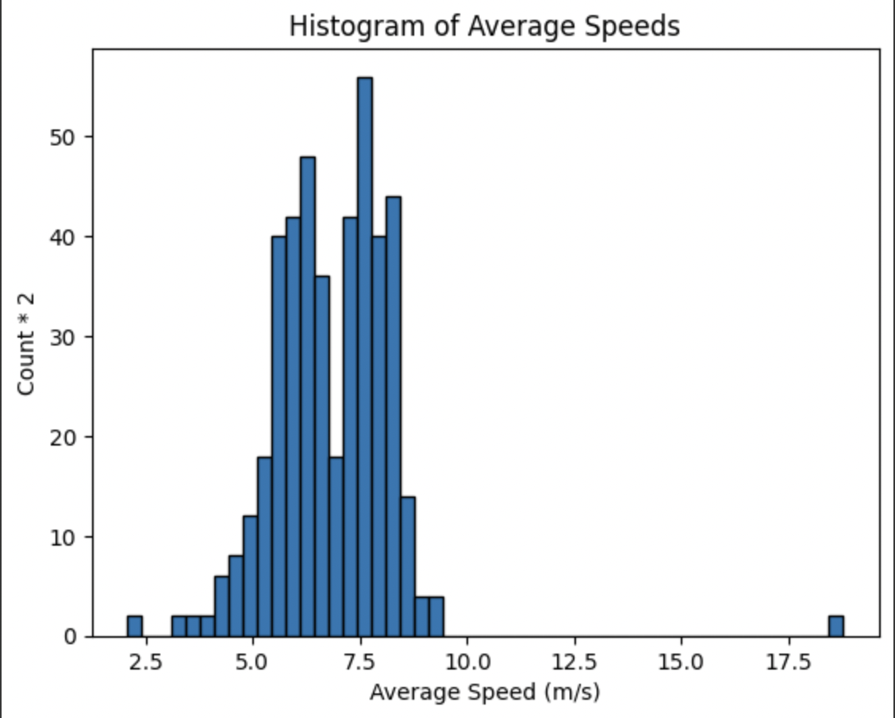

**Jacob Benson**

## About Me 
1. Personal Introduction:

    My name is Jacob Benson, a Math - Stats student at Whitman College. Areas of interest include frequentist statistical modelling, sas for experimental design and power analysis, and data science visualizations. I aspire to do statistics consulting work with research organizations as well as teaching mathematics and statistics. 

2. Portfolio Overview:

    A large portion of my work highlighted on this page will be Data Science centered, with an emphasis on visualizations.

3. Contact Me:

   - [School Email](bensonj@whitman.edu)
   - [Work Email](jbenson2470@gmail.com)
   - [LinkdIn](www.linkedin.com/in/jacob-benson-39b3b3339)

## Data Sources and Project Ideas:

### Data Links and Descriptions

1. Impaired Driving Death Rate, by Age and Gender, 2012 & 2014, All States.
    - This study comes from the data.gov, specifically from the U.S. Department of Human Services; FARS (Fatality Analysis Reporting System), published by the CDC. ([link](https://catalog.data.gov/dataset/impaired-driving-death-rate-by-age-and-gender-2012-2014-all-states))
    - The dataset includes the rates (per 100,000) of car crash fatalities involving someone who has a BAC of =>0.08%. Some minor notes are that any rate based on 20 crashes or fewer is suppressed, and all blank datapoints indicate data that has been suppressed. 

  
2. National Survey on Drug Use and Health, 2023, All States.
    - This study comes from the 2023 NSDUH (National Survey on Drug Use and Health) and is published on SAMHSA which is the Substance Abuse and Mental Health Services Administration. ([link](https://www.samhsa.gov/data/report/2023-nsduh-detailed-tables))
    - The data includes interviews from ages 12 and older, with demographic information recorded. Covered in the study is drug, alcohol, nicotine, and tobacco product use and initiation, among other mental health information.
    
    
3. National Whale and Dolphin Sightings and Strandings Database.
    - This study aggregates all whale sightings in Austrailian waters from the past 9 years and maintains stranding events around the Austrailian coastline. This comes from the Austrailian Antarctic Data Centre. ([link](https://obis.org/dataset/0b91d8f6-a50e-44e4-b313-0df7f91f7483))
    - The data includes suspected species, longitude, latitude, as well as collection nodes and dates. 

4. Microplastics in American Lobster Along the Southwestern Bay of Fundy, 2020-2022.
    - The study is produced by the Passamaquoddy Recognition Group Inc which is a non-profit organization led by the Peskotomuhkati Nation at Skutik. It is published on the Ocean Biodiversity Information System. ([link](https://obis.org/dataset/d13d69ac-1ecf-4df0-ac3d-7c767a47abe2))
    - The information contained in the data is the shell length, release, laboratory results, and a Fourier Transform Infrared Spectroscopy (FTIR) data, all for the purpose of looking at the abundance of microplastics in lobsters. 

5. Education Data K-12, Non-Fiscal and Fiscal Common core data 2023-2024.
    - This study is by the National Center for Education Statistics and the Administrative Data Division. ([link](https://nces.ed.gov/admindata/))
    - The information contained in the data is demographic information, attendence, enrollment, and more. Contained in the Fiscal common core data is information on expenditures and revenues of public elementary schools, secondary schools, school districts, and stat departments of education.

### Project Ideas

> Using the first two datasets, I think it would be really interesting to make some sort of heatmap of fatal car crashes containing a drunk driver vs different popular alcohol types and see if any pattern occurs or if there is any correlation between the two.

> Next I think making some sort of predictive model for dolphin and whale data, looking at what month/time of day you are most likely to spot a mammal in the wild, specifically in different locations.

> With the lobster dataset, I want to look at microplastic content vs  average overall pollution by Maine and Canada area.

> Finally using both education datasets, I want to investigate if there is a correlation between geographic location, school funding and attendence or grade data. 

## Where's Schueller

In one of my recent data science projects, I looked at Professor Schueller's phone location data. This imbedded plotly visualization is showing the first and last points recorded along a stretch of the five mile road in Walla Walla, which is a part of a classic bike route that Professor Schueller consistently rides. 



From this, we can take the time between first and last point, and divide by distance to obtain average velocity over the stretch. After filtering out any velocities below 2 m/s (4.4mph), you can obtain the following histogram of 2*counts by velocity. 

